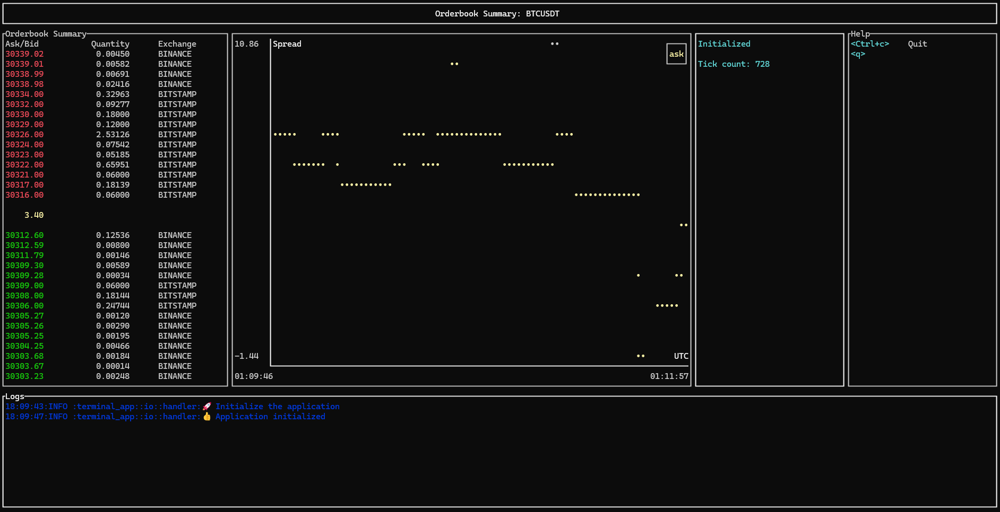

# orderbook-agg [WIP]

This repo consists of two crates:

1. [orderbook-agg](./orderbook-agg/README.md)
1. [terminal-app](./terminal-app/README.md)

## orderbook-agg

gRPC server that streams aggregate orderbook data from multiple exchanges.

## terminal-app

Simple terminal app that displays streaming summary of aggregate orderbook.

